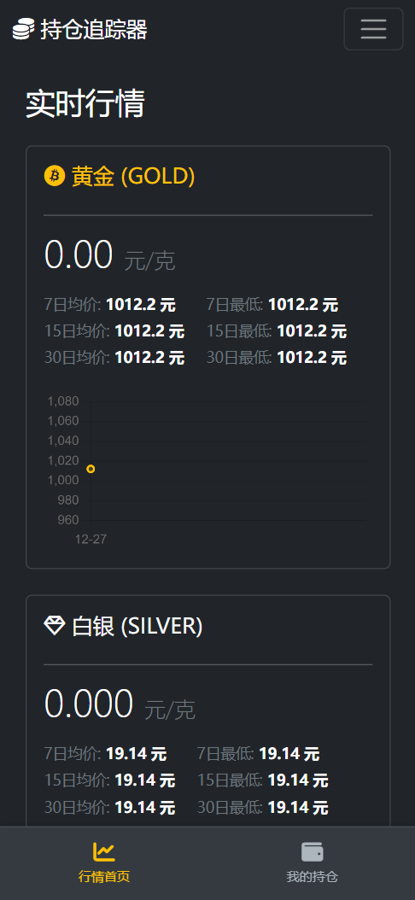
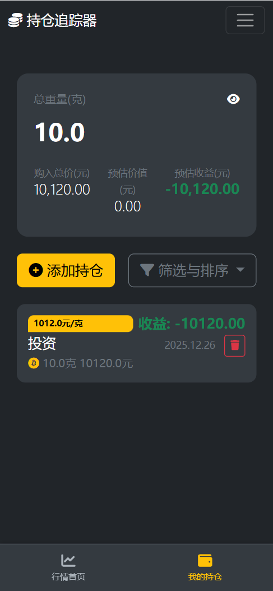

# 黄金持仓追踪器 (Gold Portfolio Tracker)


一个功能完善的个人黄金/白银持仓追踪Web应用。它能自动从网络获取最新的金银价格，帮助用户管理自己的持仓记录，并实时计算收益情况。

## ✨ 主要功能

- **实时价格追踪**: 后台服务定时从 `huangjinjiage.com.cn` 抓取最新的黄金与白银价格。
- **历史价格图表**: 在首页以动态图表形式展示过去30天的价格走势。
- **多维度数据分析**: 自动计算并展示7日、15日、30日的平均价格与最低价格。
- **个人持仓管理**:
    - 添加、删除持仓记录（描述、重量、金额、日期）。
    - 实时计算每笔持仓的当前价值与浮动盈亏。
    - 汇总统计总持仓、总成本、总价值与总盈亏。
- **高级筛选与排序**: 在持仓页面，可通过紧凑的下拉菜单按日期范围筛选或按重量/日期排序，操作后列表自动刷新。
- **后台管理**: 提供一个简单的后台页面，用于手动添加、编辑或删除历史价格数据。
- **安全登录**: 通过独立的登录页面保护用户数据。
- **现代化UI/UX**:
    - 全站采用优雅的**暗黑主题**。
    - **响应式设计**，在PC端和移动端均有良好体验。
    - 移动端采用**底部固定导航栏**，核心操作触手可及。

## 📸 界面预览

|                行情首页                |                   我的持仓                    |
|:----------------------------------:|:-----------------------------------------:|
|  |  |
|         *展示实时价格、分析数据和历史图表*         |           *展示持仓列表、汇总信息和下拉筛选菜单*            |

|                  价格管理                   |
|:---------------------------------------:|
|  |
|             *底部固定导航栏，适配小屏幕*             |


## 🛠️ 技术栈

- **后端**: Python 3.9, Flask, SQLAlchemy, Flask-Migrate, APScheduler
- **前端**: HTML, CSS, JavaScript, Bootstrap 5, Chart.js
- **数据库**: SQLite
- **数据源**: `res.huangjinjiage.com.cn` JS接口

## 🚀 部署与运行

### 1. 环境准备

- 确保您的服务器已安装 **Python 3.9** 和 **Git**。

### 2. 克隆与安装

```bash
# 克隆项目到本地
git clone <your-repository-url>
cd gold-tracker

# 创建并激活Python虚拟环境
python3.9 -m venv venv
source venv/bin/activate

# 安装所有依赖
pip install -r requirements.txt
```

### 3. 初始化配置

- **设置登录凭证**:
  打开 `app.py` 文件，修改以下两行以设置您自己的管理员用户名和密码：
  ```python
  CONFIG_USERNAME = 'your_username'
  CONFIG_PASSWORD = 'your_strong_password'
  ```

- **初始化数据库**:
  在项目根目录下，依次执行以下命令来创建数据库和迁移文件。
  ```bash
  # (仅在首次部署时需要) 初始化迁移环境
  flask db init

  # (仅在首次部署时需要) 创建第一个迁移脚本
  flask db migrate -m "Initial migration"
  
  # 将迁移应用到数据库，创建所有表
  flask db upgrade
  ```

### 4. 运行应用 (生产环境)

推荐使用 Gunicorn 作为Web服务器。您需要打开两个终端会话或使用后台运行。

- **启动后台价格抓取服务**:
  ```bash
  # 使用 nohup 保证进程在您退出终端后依然运行
  # 日志将输出到 scheduler.log 文件
  nohup python -u scheduler.py >> scheduler.log 2>&1 &
  ```

- **启动Web应用服务**:
  ```bash
  # 启动 Gunicorn，开启4个工作进程，监听在5000端口
  gunicorn -w 4 -b 0.0.0.0:5000 app:app &
  ```

现在，您可以通过 `http://<您的服务器IP>:5000` 访问您的黄金持仓追踪器了！

### 5. 本地开发

如果您想在本地进行开发和测试，只需运行：
```bash
python app.py
```
这会启动一个内置的开发服务器，当代码变动时会自动重启。

## 📁 文件结构说明

```
/gold-tracker
├── app.py                  # Flask 主应用文件
├── scheduler.py            # 后台定时任务文件
├── requirements.txt        # Python 依赖列表 (兼容Python 3.9)
├── instance/
│   └── portfolio.db        # SQLite 数据库文件 (自动生成)
├── migrations/             # Flask-Migrate 数据库迁移文件夹
│   ├── versions/
│   │   └── ..._migration_scripts.py
│   ├── alembic.ini
│   └── env.py
└── templates/
    ├── layout.html         # 全局基础模板 (含导航栏)
    ├── index.html          # 行情首页 (调用 partial)
    ├── portfolio.html      # 我的持仓页面
    ├── login.html          # 登录页面
    ├── manage_prices.html  # 后台价格管理页面
    └── partials/           # 可复用的HTML模板片段
        └── metal_info.html # 行情卡片模板
```

## 📄 许可证

本项目采用 [MIT](https://choosealicense.com/licenses/mit/) 许可证。
